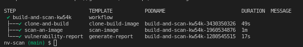

# labs-argo
Testing some argo tools + nv scan
---

## Folders:
- argo-cd
    - basic install
- argo-workflow
    - basic-examples
    - katacoda-examples
    - nv-scan

## Neuvector Scan Example:
- https://github.com/achdevops/labs-argo/blob/main/workflow/nv-scan/nv-scan.yaml

## Argo WF Details:

### Inputs:

```
    # number high/med vulnerabilities to fail the pipeline
    - name: high-vul-to-fail
      value: 3
    - name: med-vul-to-fail
      value: 0
    # specific CVE name to fail
    - name: names-vul-to-fail
      value: ""
    # paste your license key
    - name: license
      value: "insert-your-nv-license-key"
```

### Templates:
- clone repo and build the docker image
    - inputs:
        - git repository
        - tag revision
    - outputs: 
        - save image as artifact (.tar)

```
- name: clone-build-image
    inputs:
      artifacts:
        - name: code
          path: /src
          git:
            repo: "{{workflow.parameters.repo}}"
            revision: "{{workflow.parameters.revision}}"
...
...
...

 outputs:
      artifacts:
      - name: my-image-artifact
        path: /src/my-image-latest.tar
```

- start scanner & scan the image
    - inputs:
        - docker image artifact
        - docker credentials as kubernetes secret (regsecret)
    - outputs: 
        - save scanner report as artifact (json)

```
 - name: scan-image
    inputs:
      artifacts:
      - name: image-to-scan
        path: /src/my-image-latest.tar
    volumes:
      - name: docker-config
        secret:
          secretName: regsecret
    container:
      image: docker:19.03.13
      command: [sh, -c]
      args: ["until docker ps; do sleep 3; \
              cd /src; ls; \
              docker load < my-image-latest.tar; \
              docker pull neuvector/scanner:latest; \
              docker images; \ 
              docker run -i --privileged --name neuvector.scanner -e SCANNER_REPOSITORY=my-image -e SCANNER_TAG=latest -e SCANNER_LICENSE={{workflow.parameters.license}} -v /var/run/docker.sock:/var/run/docker.sock -v /var/neuvector:/var/neuvector neuvector/scanner; \
              docker cp neuvector.scanner:/var/neuvector/scan_result.json .; \
              docker rm neuvector.scanner; \
              done"]
    
    ...
    ...
    ...

    outputs:
      artifacts:
      - name: my-scan-report
        path: /src/scan_result.json
```

- generate scan report and evaluate the criteria
    - inputs:
        - scanner report as artifact (json)
    - outputs: 
        - save report as artifact (txt and csv)


* official docs: 
    * https://github.com/argoproj/argo-workflows
    * https://github.com/argoproj/argo-workflows/tree/master/examples

* labs:
    - test internal server: https://10.1.26.102:2746